Customer shopping analysis by demographics
================
Ishali Tiwari

Introduction
------------

### Problem Statement

To study the interaction of household demographics on shopping patterns

 !

### Synopsis

> *"If you deal with every customer in the same way, you will only close 25 to 30 percent of your contacts, because you will only close one personality type. But if you learn how to effectively work with all personality types, you can conceivably close 100 percent of your contacts."* **- Rod Nichols **

When we are engaging with our customers, we may not want to direct our efforts to just one demographic. Understanding how demographics affects customers' shopping patterns will help us identify how a particular customer segment can be targeted based on its store footfalls, spending pattern, etc. and thereby increase overall sales of the store.

To understand customer engagement based on demographics, we will be using sample datasets from Kroger. The following datasets are used in this analysis:
**Transaction**: It contains transactional data of each households for 2 years (2016 & 2017)
**Household**: Contains demographics data (age, income, etc.) of each household
**Product**: Contains product data (department, category, organic flag, etc.) for each product

We will study our customers' transactional behavior across different demographic parameters such as age, marital status, income groups etc. We can leverage this information to create effective campaign (cross sell/ upsell) to drive sales in the store.

Our approach to address this problem statement would be extensive EDA to establish patterns followed by clustering to segment audience.

The patterns that emerge from this analysis will help Kroger strategize their marketing activities based on the identified key demographics and their historical performance.

Packages Required
-----------------

The following packages have been utilized in this report. Please install them if you wish to reproduce the work.

**tibble** | Provides stricter checking and better formatting than the traditional data frame
**dplyr** | A fast and consistent tool for working with data frame like objects
**lubridate** | Functions to work with date-times and time-spans
**ggplot2** | A system for 'declaratively' creating layered graphics
**data.table** | For using fread to read files efficiently
**ggfortify** | Unified plotting tools for statistics commonly used
**cluster** | For clustering
**plotly** | For plotting interactive graphs
**knitr** | For printing data tables

``` r
library(tibble) 
library(dplyr) 
library(lubridate) 
library(ggplot2) 
library(here) 
library(data.table)
library(ggfortify)
library(cluster)
library(plotly)  
library(knitr)
```

Data Preparation
----------------

### 

#### Source of Data

The data was sourced from Professor Bradley Boehmke's [Github](http://uc-r.github.io/data_wrangling/final-project "Github") and belongs to a leading grocerer.

The original purpose of this data to investigate different business questions in the retailer's transactional, product and demographic datasets. The dataset contains 5000 households, their demographic information and their transactional behavior between 1/3/2016 and 12/30/2017.

The first table contains demographic information for households in the following format:

1.  *Transactional Data*: The transactional data contains the following 9 variables

**BASKET\_NUM**: Unique basket identifier
**HSHD\_NUM**: Unique household identifier
**PURCHASE\_DATE**: Date of transaction
**PRODUCT\_NUM**: Product purchased
**SPEND**: Amount spent
**UNITS**: Number of units purchased
**STORE\_R**: Region of store
**WEEK\_NUM**: Week Number (between 1 to 104, applicable to the time period 1/3/2016 and 12/30/2017)
**YEAR**: Year (2016,2017)

1.  *Household demographic data*: The Household demographic data contains the following 9 variables

**HSHD\_NUM**: Unique household identifier
**L**: Loyalty Flag (Y or N)
**AGE\_RANGE**: Age of customer specified in ranges
**MARITAL**: Marital status of customer
**INCOME\_RANGE**: Income range of customer
**HOMEOWNER**: Whether the customer owns or rents their house
**HSHD\_COMPOSITION**: Family structure of the household (number of adults and kids)
**HH\_SIZE**: Size of a household
**CHILDREN**: Number of children in the household

1.  *Product data*: Product data contains the following 5 variables

**PRODUCT\_NUM**: Unique product identifier
**DEPARTMENT**: Department the product belongs to
**COMMODITY**: Sub-Department of the product
**BRAND\_TY**: Whether the brand is private or national
**ORGANIC**: If the product is organic or not (Y or N)

#### Data Cleaning

##### Importing the data

Considering the large volume of data, we use "fread" for it's high speed and efficiency.

``` r
files <- c("households", "products","transactions")
output<- c("households", "products","transactions")

for (i in seq_along(files)) {
  df <- fread(paste0("data/5000_",files[i],".csv"), strip.white = TRUE)
  assign(output[i], df)
} 
```

We combined all datasets into a list for applying functions collectively.

``` r
tables<-list(households,products,transactions)
```

##### Viewing the data

``` r
lapply(tables, function(x) as_tibble(head(x)))
```

    ## [[1]]
    ## # A tibble: 6 x 9
    ##   HSHD_NUM L     AGE_RANGE MARITAL INCOME_RANGE HOMEOWNER HSHD_COMPOSITION
    ##      <int> <chr> <chr>     <chr>   <chr>        <chr>     <chr>           
    ## 1      688 Y     75+       Unknown 35-49K       Homeowner <NA>            
    ## 2     2590 N     75+       Unknown 50-74K       Homeowner <NA>            
    ## 3     1171 Y     75+       Unknown 75-99K       Homeowner <NA>            
    ## 4     1531 Y     75+       Unknown 75-99K       Homeowner <NA>            
    ## 5      403 N     75+       Unknown UNDER 35K    Renter    <NA>            
    ## 6      283 Y     25-34     Unknown 50-74K       Homeowner <NA>            
    ## # ... with 2 more variables: HH_SIZE <chr>, CHILDREN <chr>
    ## 
    ## [[2]]
    ## # A tibble: 6 x 5
    ##   PRODUCT_NUM DEPARTMENT COMMODITY BRAND_TY V5   
    ##         <int> <chr>      <chr>     <chr>    <chr>
    ## 1       92993 NON-FOOD   PET       PRIVATE  N    
    ## 2       93924 NON-FOOD   PET       PRIVATE  N    
    ## 3       94272 NON-FOOD   PET       PRIVATE  N    
    ## 4       94299 NON-FOOD   PET       PRIVATE  N    
    ## 5       94594 NON-FOOD   PET       PRIVATE  N    
    ## 6       94606 NON-FOOD   PET       PRIVATE  N    
    ## 
    ## [[3]]
    ## # A tibble: 6 x 9
    ##   BASKET_NUM HSHD_NUM PURCHASE_ PRODUCT_NUM SPEND UNITS STORE_R WEEK_NUM
    ##        <int>    <int> <chr>           <int> <dbl> <int> <chr>      <int>
    ## 1         24     1809 03-JAN-16     5817389 -1.5     -1 SOUTH          1
    ## 2         24     1809 03-JAN-16     5829886 -1.5     -1 SOUTH          1
    ## 3         34     1253 03-JAN-16      539501  2.19     1 EAST           1
    ## 4         60     1595 03-JAN-16     5260099  0.99     1 WEST           1
    ## 5         60     1595 03-JAN-16     4535660  2.5      2 WEST           1
    ## 6        168     3393 03-JAN-16     5602916  4.5      1 SOUTH          1
    ## # ... with 1 more variable: YEAR <int>

##### Renaming the Columns

Some of the columns in data are named incorrectly. Hence we rename them to add more context and enhance readability.

``` r
names(households)[2]<-"LOYALTY"
names(products)[5]<-"ORGANIC"
names(transactions)[3]<-"PURCHASE_DATE"
```

##### Setting Datatypes

``` r
structure<-list(lapply(tables,str))
```

We convert all of our categorical variables to factors. We also set the correct datatypes for date values present in transaction table.

``` r
households<-cbind(households[,1],data.frame(apply(households[,2:9],2, factor)))
products<-cbind(products[,1],data.frame(apply(products[,2:5],2, factor)))
transactions$PURCHASE_DATE<-as.Date(transactions$PURCHASE_DATE,"%d-%b-%y")
transactions$YEAR<-year(as.Date(as.character(transactions$YEAR),"%Y"))
households$INCOME_RANGE<-factor(households$INCOME_RANGE, 
                                levels =c("null","UNDER 35K","35-49K",
                                          "50-74K","75-99K","100-150K","150K+"))
```

##### Missing Values

``` r
tables<-list(households,products,transactions)
sapply(tables,summary)
```

There are at least 865 "null" values in all columns of household data (except hshd\_num and loyalty), we investigate this further.

``` r
summary(households[households$AGE_RANGE=="null",])
```

    ##     HSHD_NUM    LOYALTY   AGE_RANGE      MARITAL       INCOME_RANGE
    ##  Min.   :  20   N:146   null   :865   Married:  0   null     :865  
    ##  1st Qu.:1888   Y:719   19-24  :  0   null   :865   UNDER 35K:  0  
    ##  Median :3361           25-34  :  0   Single :  0   35-49K   :  0  
    ##  Mean   :3135           35-44  :  0   Unknown:  0   50-74K   :  0  
    ##  3rd Qu.:4529           45-54  :  0                 75-99K   :  0  
    ##  Max.   :5000           55-64  :  0                 100-150K :  0  
    ##                         (Other):  0                 150K+    :  0  
    ##      HOMEOWNER            HSHD_COMPOSITION HH_SIZE             CHILDREN  
    ##  Homeowner:  0   1 Adult          :  0     1   :  0   1            :  0  
    ##  null     :865   1 Adult and Kids :  0     2   :  0   2            :  0  
    ##  Renter   :  0   2 Adults         :  0     3   :  0   3+           :  0  
    ##  Unknown  :  0   2 Adults and Kids:  0     4   :  0   NOT AVAILABLE:  0  
    ##                  null             :865     5+  :  0   null         :865  
    ##                  Single Female    :  0     null:865                      
    ##                  Single Male      :  0

Clearly, we only have loyalty information for these 865 households, hence we will not consider these while analyzing the customers based on demographics.

``` r
sapply(tables,function(x) any(is.na(x)))
```

Product and Transaction table do not have missing values

##### Observing key categorical variables

``` r
summary(households$INCOME_RANGE)
```

    ##      null UNDER 35K    35-49K    50-74K    75-99K  100-150K     150K+ 
    ##       865       790       876       947       594       581       347

``` r
summary(households$AGE_RANGE)
```

    ##         19-24         25-34         35-44         45-54         55-64 
    ##            36           306           664          1125           984 
    ##         65-74           75+ NOT AVAILABLE          null 
    ##           579           309           132           865

##### Observing key metric variables

The columns in products and transactions tables do not have any missing values, however households contains missing values.

``` r
summary(transactions[5:6])
```

    ##    BASKET_NUM     HSHD_NUM    PURCHASE_DATE         PRODUCT_NUM     
    ##  Min.   : 60   Min.   :1595   Min.   :2016-01-03   Min.   :4535660  
    ##  1st Qu.: 87   1st Qu.:2044   1st Qu.:2016-01-03   1st Qu.:4802474  
    ##  Median :114   Median :2494   Median :2016-01-03   Median :5069288  
    ##  Mean   :114   Mean   :2494   Mean   :2016-01-03   Mean   :5069288  
    ##  3rd Qu.:141   3rd Qu.:2944   3rd Qu.:2016-01-03   3rd Qu.:5336102  
    ##  Max.   :168   Max.   :3393   Max.   :2016-01-03   Max.   :5602916  
    ##      SPEND         UNITS        STORE_R             WEEK_NUM
    ##  Min.   :2.5   Min.   :1.00   Length:2           Min.   :1  
    ##  1st Qu.:3.0   1st Qu.:1.25   Class :character   1st Qu.:1  
    ##  Median :3.5   Median :1.50   Mode  :character   Median :1  
    ##  Mean   :3.5   Mean   :1.50                      Mean   :1  
    ##  3rd Qu.:4.0   3rd Qu.:1.75                      3rd Qu.:1  
    ##  Max.   :4.5   Max.   :2.00                      Max.   :1  
    ##       YEAR     
    ##  Min.   :2016  
    ##  1st Qu.:2016  
    ##  Median :2016  
    ##  Mean   :2016  
    ##  3rd Qu.:2016  
    ##  Max.   :2016

As we see, the variables contain major upper tail outliers and negative values as well

``` r
quantile(transactions$SPEND,probs= c(0.9,0.95,0.999))
```

    ##      90%      95%    99.9% 
    ##  6.99000  9.99000 39.33448

``` r
quantile(transactions$UNITS,probs= c(0.9,0.95,0.999))
```

    ##   90%   95% 99.9% 
    ##     2     3    10

Imputing spend data at 99.9% to exclude outliers

``` r
transactions<-filter(transactions,SPEND<40, UNITS<10)
```

##### Abnormal values

There exist values in transaction table where spend is less than 0 and units are greater than zero. There are also cases where spend is greater than zero, however units are less than zero. We would remove such values for our usage.

``` r
transactions_clean<-transactions%>% filter(!((SPEND<0 & UNITS>0) | (SPEND>0 & UNITS<=0)))
```

#### Cleaned data

**Household data**

``` r
kable(head(households,5))
```

|  HSHD\_NUM| LOYALTY | AGE\_RANGE | MARITAL | INCOME\_RANGE | HOMEOWNER | HSHD\_COMPOSITION | HH\_SIZE | CHILDREN      |
|----------:|:--------|:-----------|:--------|:--------------|:----------|:------------------|:---------|:--------------|
|        688| Y       | 75+        | Unknown | 35-49K        | Homeowner | NA                | null     | NOT AVAILABLE |
|       2590| N       | 75+        | Unknown | 50-74K        | Homeowner | NA                | null     | NOT AVAILABLE |
|       1171| Y       | 75+        | Unknown | 75-99K        | Homeowner | NA                | null     | NOT AVAILABLE |
|       1531| Y       | 75+        | Unknown | 75-99K        | Homeowner | NA                | null     | NOT AVAILABLE |
|        403| N       | 75+        | Unknown | UNDER 35K     | Renter    | NA                | null     | NOT AVAILABLE |

**Product Data**

``` r
kable(head(products,5))
```

|  PRODUCT\_NUM| DEPARTMENT | COMMODITY | BRAND\_TY | ORGANIC |
|-------------:|:-----------|:----------|:----------|:--------|
|         92993| NON-FOOD   | PET       | PRIVATE   | N       |
|         93924| NON-FOOD   | PET       | PRIVATE   | N       |
|         94272| NON-FOOD   | PET       | PRIVATE   | N       |
|         94299| NON-FOOD   | PET       | PRIVATE   | N       |
|         94594| NON-FOOD   | PET       | PRIVATE   | N       |

**Transaction data**

``` r
kable(head(transactions_clean,5))
```

|  BASKET\_NUM|  HSHD\_NUM| PURCHASE\_DATE |  PRODUCT\_NUM|  SPEND|  UNITS| STORE\_R |  WEEK\_NUM|  YEAR|
|------------:|----------:|:---------------|-------------:|------:|------:|:---------|----------:|-----:|
|           24|       1809| 2016-01-03     |       5817389|  -1.50|     -1| SOUTH    |          1|  2016|
|           24|       1809| 2016-01-03     |       5829886|  -1.50|     -1| SOUTH    |          1|  2016|
|           34|       1253| 2016-01-03     |        539501|   2.19|      1| EAST     |          1|  2016|
|           60|       1595| 2016-01-03     |       5260099|   0.99|      1| WEST     |          1|  2016|
|           60|       1595| 2016-01-03     |       4535660|   2.50|      2| WEST     |          1|  2016|

Exploratory data analysis
-------------------------

### 

#### Age

``` r
###Creating new variables
tp_clean<-transactions_clean %>% left_join(products, by="PRODUCT_NUM")

X <-tp_clean %>% group_by(HSHD_NUM) %>% 
  filter(SPEND>0, UNITS>0) %>% 
  summarize(Total_spent= sum(SPEND), Total_units=sum(UNITS))

Y<-tp_clean %>% group_by(HSHD_NUM) %>% 
  filter(SPEND<0, UNITS<0) %>% 
  summarize(Total_spent_return= sum(SPEND), Total_units_return=sum(UNITS))

Z<-tp_clean %>% group_by(HSHD_NUM) %>% 
 summarize(Frequency= n_distinct(BASKET_NUM), No_of_dep=length(unique(DEPARTMENT)))

tp<-Reduce(left_join, list(X,Y,Z))
```

``` r
Spend_by_Age<-tp%>%
  left_join(households, by="HSHD_NUM") %>%
  group_by(AGE_RANGE,LOYALTY) %>% 
  summarize(Spend_per_visit= mean((Total_spent/Frequency)), 
  Avg_freq=round(mean(Frequency)), 
  Avg_dep_visited=round(mean(No_of_dep)),
  Avg_spend= mean(Total_spent), 
  Avg_units_purchased= mean(Total_units), 
  Avg_spend_return= mean(Total_spent_return, na.rm=T),
  Avg_units_returned=mean(Total_units_return, na.rm=T))
```

##### Total Spend pattern of customers by loyalty and age

``` r
Spend_by_Age %>% 
  filter(!AGE_RANGE %in% c("NOT AVAILABLE","null")) %>% 
  ggplot( aes(x=AGE_RANGE, y=Avg_spend))+
  geom_bar(aes(fill= -Avg_units_purchased), stat="identity") + 
  facet_grid(LOYALTY~.) + 
  xlab("Age Group") + 
  ylab("Average Total Spend") + scale_color_brewer(palette="Dark2")
```

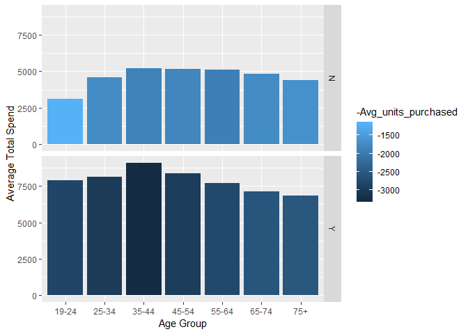

Loyal customers between the age of 35-44 are our highest spenders and visitors, however our customers aged 19-24 spend the highest per visit (approx $6 per visit).

##### Spend per visit pattern of customers by loyalty and age

``` r
Spend_by_Age %>% 
  filter(!AGE_RANGE %in% c("NOT AVAILABLE","null")) %>% 
  ggplot( aes(x=AGE_RANGE, y=Spend_per_visit))+
  geom_bar(aes(fill= -Avg_spend), stat="identity") + 
  facet_grid(LOYALTY~.) + 
  #ggtitle("Spend per visit pattern of customers by loyalty and age") +
  xlab("Age Group") + 
  ylab("Average Spend per visit") + scale_color_brewer(palette="Dark2")
```

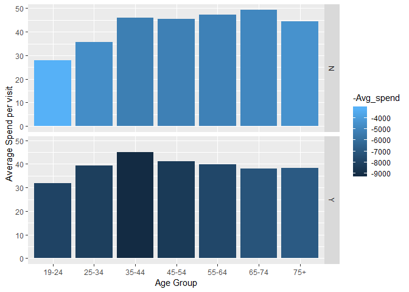

Loyal customers between 25-34 (young work force) have the highest return transaction amount. However, all customers in the 65-74 age group have high return amounts.

##### Return transaction pattern of customers by loyalty and age

``` r
Spend_by_Age %>% 
  filter(!AGE_RANGE %in% c("NOT AVAILABLE","null")) %>% 
  ggplot( aes(x=AGE_RANGE, y=-Avg_spend_return ))+
  geom_bar(aes(fill= Avg_units_returned), stat="identity") + 
  facet_grid(LOYALTY~.) + 
  #ggtitle("Return transaction pattern of customers by loyalty and age") +
  xlab("Age Group") + 
  ylab("Average spend returned") + scale_color_brewer(palette="Dark2")
```

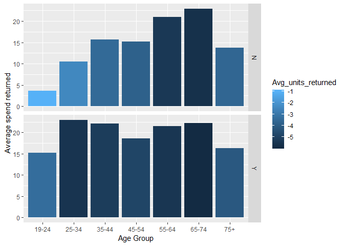

Despite not being the highest spenders overall or per visit, the older customers tend to have the highest amount of returns. Moreover, the proportion of returns by non-loyal customers is higher for older customers.

#### Age over Time

``` r
X <-tp_clean %>% group_by(WEEK_NUM,HSHD_NUM) %>% 
  filter(SPEND>0, UNITS>0) %>% 
  summarize(Total_spent= sum(SPEND), Total_units=sum(UNITS))

Y<-tp_clean %>% group_by(WEEK_NUM,HSHD_NUM) %>% 
  filter(SPEND<0, UNITS<0) %>% 
  summarize(Total_spent_return= sum(SPEND), Total_units_return=sum(UNITS))

Z<-tp_clean %>% group_by(WEEK_NUM,HSHD_NUM) %>% 
 summarize(Frequency= n_distinct(BASKET_NUM), No_of_dep=length(unique(DEPARTMENT)))

tpx<-Reduce(left_join, list(X,Y,Z))
```

    ## Joining, by = c("WEEK_NUM", "HSHD_NUM")
    ## Joining, by = c("WEEK_NUM", "HSHD_NUM")

``` r
Spend_by_Age_TIME<-tpx%>%
  left_join(households, by="HSHD_NUM") %>%
  group_by(AGE_RANGE,LOYALTY,WEEK_NUM) %>% 
  summarize(Spend_per_visit= mean((Total_spent/Frequency)), 
            Avg_freq=round(mean(Frequency)), 
            Avg_spend= mean(Total_spent), 
            Avg_units_purchased= mean(Total_units), 
            Avg_spend_return= mean(Total_spent_return, na.rm=T),
            Avg_units_returned=mean(Total_units_return, na.rm=T))
```

##### Total Spend pattern of customers by loyalty and age over time

``` r
Spend_by_Age_TIME %>% 
  filter(!AGE_RANGE %in% c("NOT AVAILABLE","null")) %>% 
  ggplot( aes(x=WEEK_NUM, y=Avg_spend,color=AGE_RANGE ))+
  geom_smooth(se=F) +
  facet_grid(LOYALTY~.) + 
  #ggtitle("Total Spend pattern of customers by loyalty and age") +
  xlab("Weeks") + 
  ylab("Total Spend") + scale_color_brewer(palette="Dark2")
```

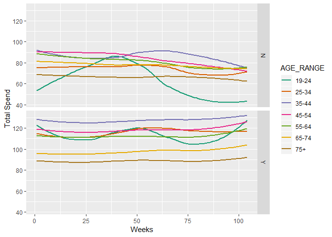

##### Spend per visit pattern of customers by loyalty and age over time

``` r
Spend_by_Age_TIME %>% 
  filter(!AGE_RANGE %in% c("NOT AVAILABLE","null")) %>% 
  ggplot( aes(x=WEEK_NUM, y=Spend_per_visit,color=AGE_RANGE ))+
  geom_smooth(se=F) +
  facet_grid(LOYALTY~.) + 
  #ggtitle("Spend per visit pattern of customers by loyalty and age") +
  xlab("Weeks") + 
  ylab("Average Spend per visit") + scale_color_brewer(palette="Dark2")
```

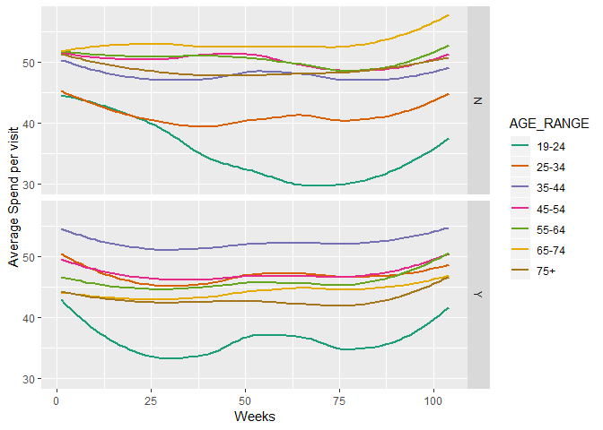

The age group 19-24 shows high variability in their total spend as compared to other age groups.

##### Return transaction pattern of customers by loyalty and age over time

``` r
Spend_by_Age_TIME %>% 
  filter(!AGE_RANGE %in% c("NOT AVAILABLE","null")) %>% 
  ggplot( aes(x=WEEK_NUM, y=-Avg_spend_return,color=AGE_RANGE ))+
  geom_smooth(se=F) +
  facet_grid(LOYALTY~.) + 
  #ggtitle("Return transaction pattern of customers by loyalty and age") +
  xlab("Weeks") + 
  ylab("Average spend returned") + scale_color_brewer(palette="Dark2")
```

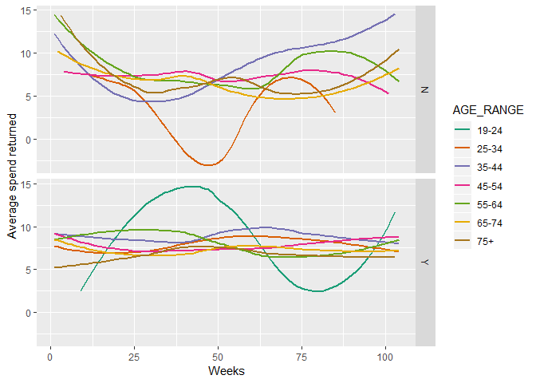

#### Income Group

``` r
Spend_by_Income<-tp%>%
  left_join(households, by="HSHD_NUM") %>%
  group_by(INCOME_RANGE,LOYALTY) %>% 
  summarize(Spend_per_visit= mean((Total_spent/Frequency)), 
  Avg_freq=round(mean(Frequency)), 
  Avg_dep_visited=round(mean(No_of_dep)),
  Avg_spend= mean(Total_spent), 
  Avg_units_purchased= mean(Total_units), 
  Avg_spend_return= mean(Total_spent_return, na.rm=T),
  Avg_units_returned=mean(Total_units_return, na.rm=T))
```

##### Total Spend pattern of customers by loyalty and income

``` r
Spend_by_Income %>% 
  filter(!INCOME_RANGE %in% c("null")) %>% 
  ggplot( aes(x=INCOME_RANGE, y=Avg_spend ))+
  geom_bar(aes(fill= -Avg_units_purchased), stat="identity") + 
  facet_grid(LOYALTY~.) + 
  #ggtitle("TOtal Spend pattern of customers by loyalty and age") +
  xlab("Income Group") + 
  ylab("Average Spend") + scale_color_brewer(palette="Dark2")
```

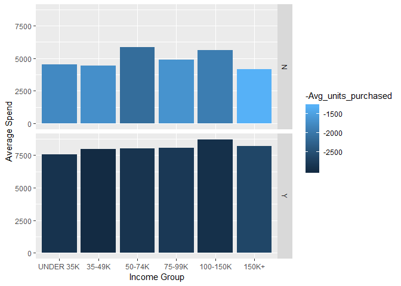

##### Spend per visit pattern of customers by loyalty and income

``` r
Spend_by_Income %>% 
  filter(!INCOME_RANGE %in% c("null")) %>% 
  ggplot( aes(x=INCOME_RANGE, y=Spend_per_visit))+
  geom_bar(aes(fill= -Avg_spend), stat="identity") + 
  facet_grid(LOYALTY~.) + 
  #ggtitle("Spend per visit pattern of customers by loyalty and age") +
  xlab("Income Group") + 
  ylab("Average Spend per visit") + scale_color_brewer(palette="Dark2")
```

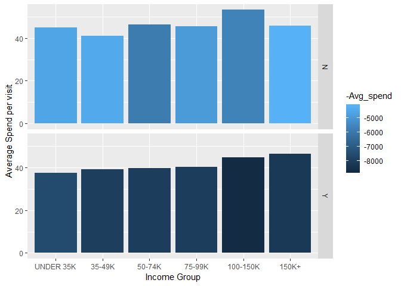

##### Return transaction pattern of customers by loyalty and income

``` r
Spend_by_Income %>% 
  filter(!INCOME_RANGE %in% c("null")) %>% 
  ggplot( aes(x=INCOME_RANGE, y=-Avg_spend_return ))+
  geom_bar(aes(fill= Avg_units_returned), stat="identity") + 
  facet_grid(LOYALTY~.) + 
  #ggtitle("Return transaction pattern of customers by loyalty and age") +
  xlab("Income Group") + 
  ylab("Average spend returned") + scale_color_brewer(palette="Dark2")
```

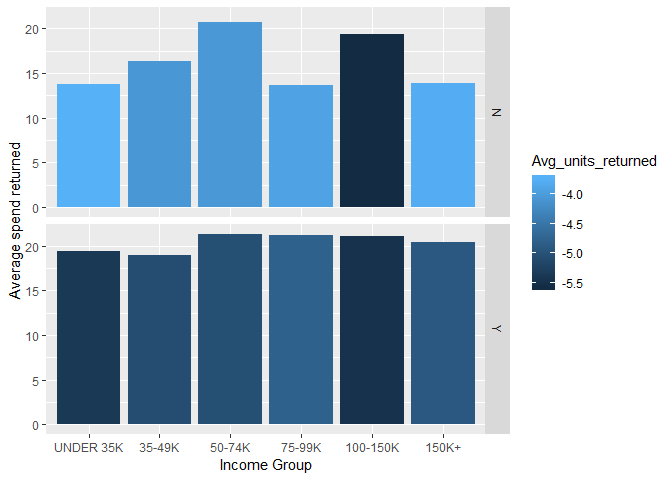

#### Income Group over Time

``` r
Spend_by_Age_Income<-tpx%>%
  left_join(households, by="HSHD_NUM") %>%
  group_by(INCOME_RANGE,LOYALTY,WEEK_NUM) %>% 
  summarize(Spend_per_visit= mean((Total_spent/Frequency)), 
            Avg_freq=round(mean(Frequency)), 
            Avg_spend= mean(Total_spent), 
            Avg_units_purchased= mean(Total_units), 
            Avg_spend_return= mean(Total_spent_return, na.rm=T),
            Avg_units_returned=mean(Total_units_return, na.rm=T))
```

##### Total Spend pattern of customers by loyalty and income over time

``` r
Spend_by_Age_Income %>% 
  filter(!INCOME_RANGE %in% c("null")) %>% 
  ggplot( aes(x=WEEK_NUM, y=Avg_spend,color=INCOME_RANGE ))+
  geom_smooth(se=F) +
  facet_grid(LOYALTY~.) + 
  #ggtitle("Total Spend pattern of customers by loyalty and income") +
  xlab("Weeks") + 
  ylab("Total Spend per visit") + scale_color_brewer(palette="Dark2")
```

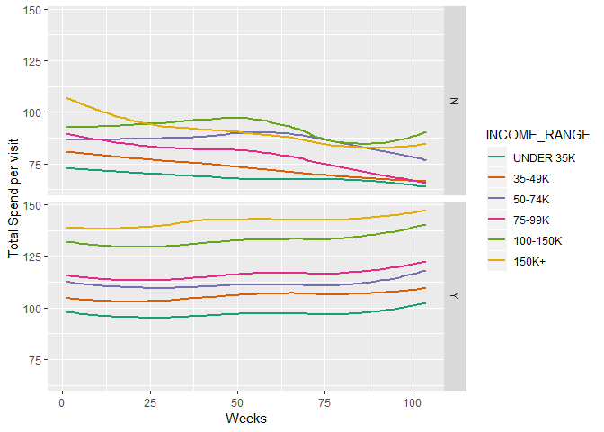

Loyal customers behave exactly based on their earning capacity

##### Spend per visit pattern of customers by loyalty and income over time

``` r
Spend_by_Age_Income %>% 
  filter(!INCOME_RANGE %in% c("null")) %>% 
  ggplot( aes(x=WEEK_NUM, y=Spend_per_visit,color=INCOME_RANGE))+
  geom_smooth(se=F) +
  facet_grid(LOYALTY~.) + 
  #ggtitle("Spend per visit pattern of customers by loyalty and income") +
  xlab("Weeks") + 
  ylab("Average Spend per visit") + scale_color_brewer(palette="Dark2")
```

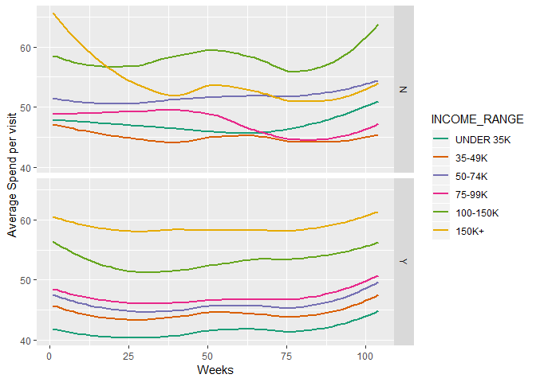

##### Return transaction pattern of customers by loyalty and income over time

``` r
Spend_by_Age_Income %>% 
  filter(!INCOME_RANGE %in% c("null")) %>% 
  ggplot( aes(x=WEEK_NUM, y=-Avg_spend_return,color=INCOME_RANGE))+
  geom_smooth(se=F) +
  facet_grid(LOYALTY~.) + 
  #ggtitle("Return transaction pattern of customers by loyalty and age") +
  xlab("Weeks") + 
  ylab("Average spend returned (in dollars)") + scale_color_brewer(palette="Dark2")
```

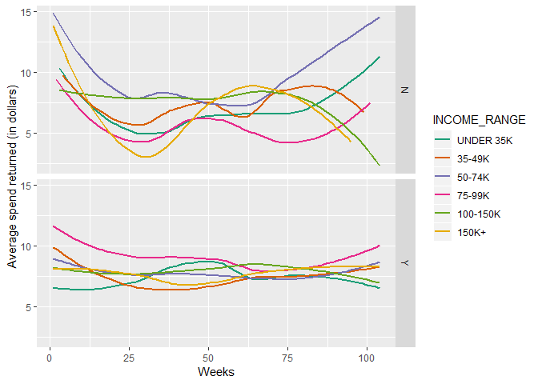

Clustering
----------

Now we are ready to perform k-means clustering to segment our customers. Think of clusters as groups in the customer base. We will cluster the customers based on total spend in dollars, total units purchased, total return in dollars, total units returned, frequency of visits to the store and coverage(No of departments).Prior to the model, we will need to choose the number of customer groups, k, that are to be detected.

### The Elbow Method

The Elbow method is a method of interpretation and validation of consistency within cluster analysis designed to help finding the appropriate number of clusters in a dataset. This method looks at the percentage of variance explained as a function of the number of clusters to identify the right number of clusters. Number of clusters should be chosen in a way that adding another cluster doesn't give a more distinct grouping of the data.

``` r
set.seed(20)
#Replacing Null values to zero for the analysis 
tp[is.na(tp)]<-0
tp<-abs(tp)
# Compute and plot wss for k = 2 to k = 15.
k.max <- 15

#Standardizing columns 

data <- as.data.frame(scale(tp[2:7]))

#Using Elbow method to get optimum number of clusters
wss <- sapply(1:k.max, 
              function(k){kmeans(data, k, nstart=50,iter.max = 15 )$tot.withinss})
wss

#Plotting the Elbow Curve
```

``` r
plot(1:k.max, wss,
     type="b", pch = 19, frame = FALSE, 
     xlab="Number of clusters K",
     ylab="Total within-clusters sum of squares")
```

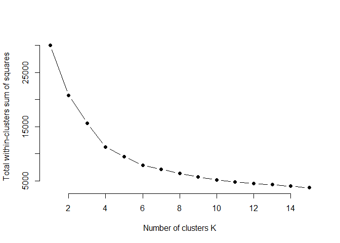

### Running the K-means algorithm

The optimum number of clusters detected are 6. While performing the k-means analysis we have dropped all the model and features of the data and only kept numerical columns for the analysis.

``` r
#Clustering with 6 clusters using K-means
Cluster <- kmeans(data, 6, nstart = 20)

X<-cbind(tp,Cluster$cluster)
names(X)[8]<-"clus_no"

autoplot(Cluster, data=data,  frame = TRUE)
```

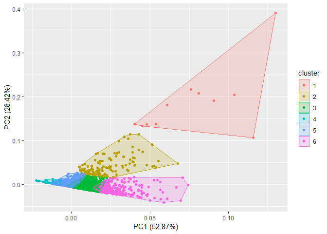

``` r
#ggplot(X, aes(Total_spent, No_of_dep, color = clus_no)) + geom_point()
```

### Interpreting the results

The clusters present some interesting insights about our customers. For brevity we wont display the tables. Here are the results:

**Cluster 1**: Contains 11 customers.They are our highly engaged customers. These customers are very frequent to the store and on an average have high dollar spend each time they visit the store.

**Cluster 2**: Contains 127 customers. They are our medium spend customers and have a high tendency to return items they purchase. They usually have a high dollar return in the store.

**Cluster 3**: Contains 1593 customers. They are our medium spend customers with low tendency to return items they purchase.

**Cluster 4**: Contains 994 customers. They are our least engaged customers with low spend and low frequency. There is a high scope to increase the engagement for these customers

**Cluster 5**: Contains 1941 customers.They are our least engaged customers with low spend but they also have very low return. So, these customers rarely return stuffs they purchase.

**Cluster 6**: Contains 329 customers. These are our highly engaged customers with high spend, high frequency and low return

Summary
-------

### Data Insights

-   Loyal customers between the age of 35-44 are our highest spenders and visitors, however our customers aged 19-24 spend the highest per visit (approx $6 per visit).
-   Loyal customers between 25-34 (young work force) have the highest return transaction amount. However, all customers in the 65-74 age group have high return amounts.
-   Despite not being the highest spenders overall or per visit, the older customers tend to have the highest amount of returns. Moreover, the proportion of returns by non-loyal customers is higher for older customers.
-   The age group 19-24 shows high variability in their total spend and returns over time as compared to other age groups.
-   Total spend for Loyal customers is directly proportional to the household income, however customers in the income range of 50-74k tend to spend the most amongst non-loyal customers.
-   We see a declining trend in non loyal customers shopping with us over time, however minimal hike in Loyal customers which means that the grocerer is losing customers.

### Methodology

Since the results obtained from EDA do not bring about a distinctive difference in the shopping pattern for age groups or income groups, we perform clustering to segment our customers without demographic information.

### Recommendations

To get the most uplift from a marketing campaign, the campaign should be directed at the customers most likely to respond to it. By using customer segmentation to determine actionable customer prototypes, the grocerer can test different campaigns on particularly relevant target groups of customers. Over time, the results of these campaigns can be evaluated and compared to find the most effective offers to each of our 6 customer segment.

For example, **Cluster 1 & 6 are our highly engaged customers** and hence can be targeted using bundled offers to up-sell. **Cluster 4 is our least engaged group**. They can be targeted with promotional offers to avoid churn in the store.
